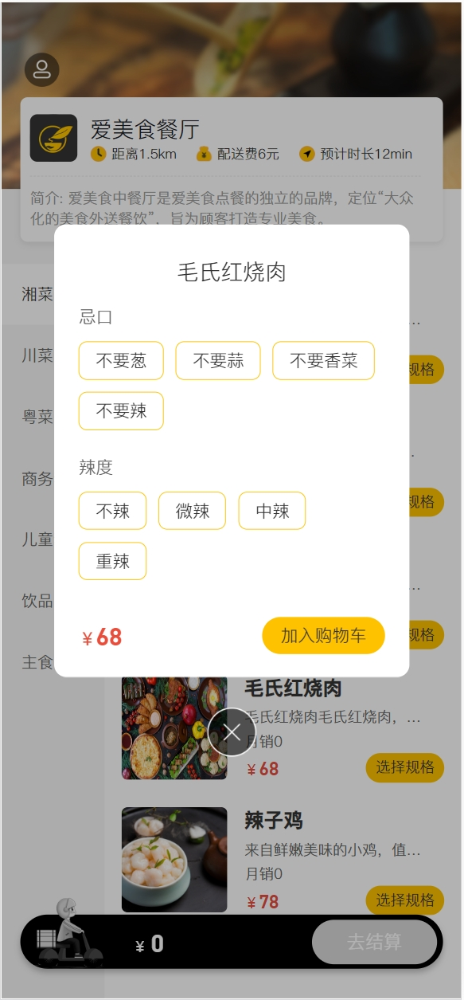
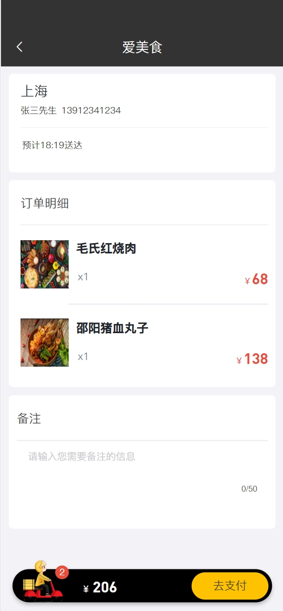
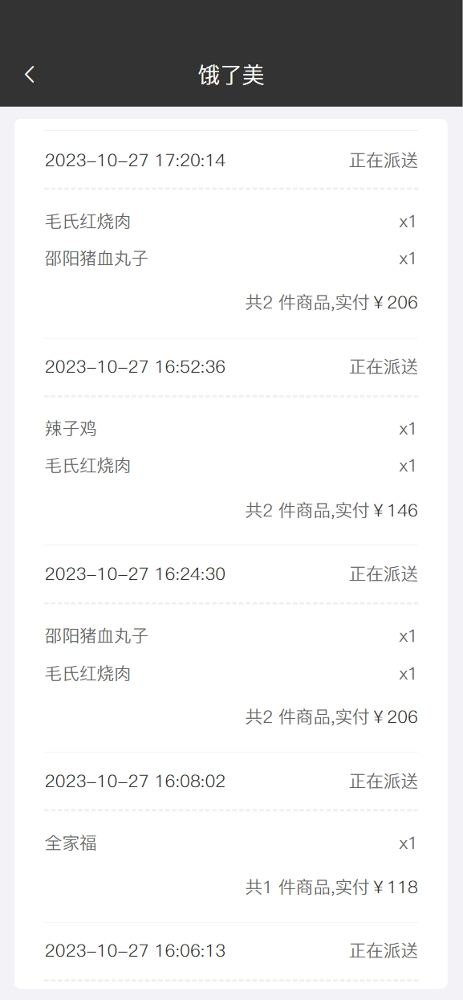
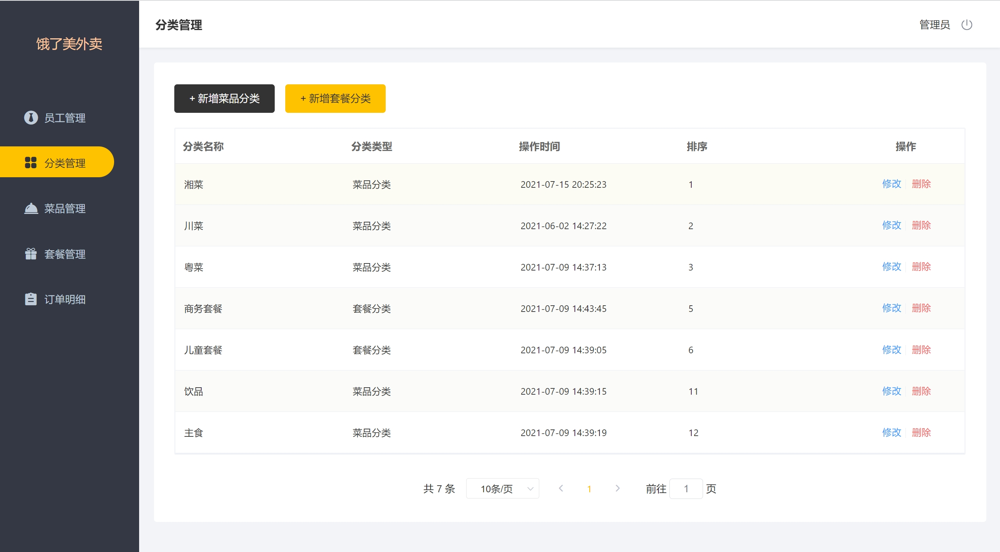
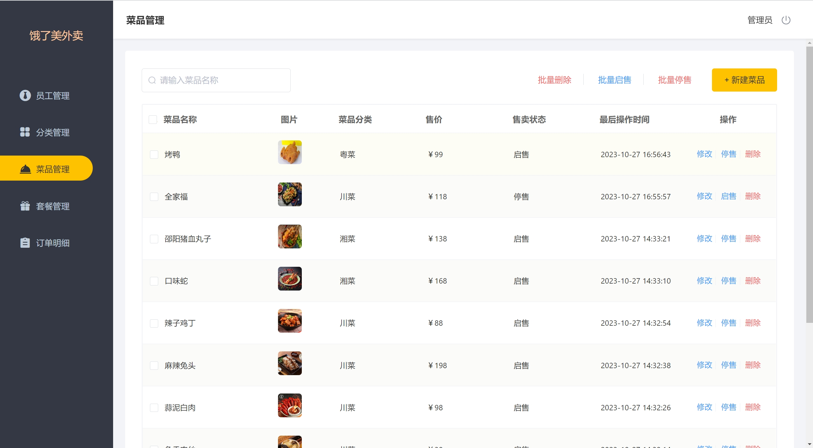
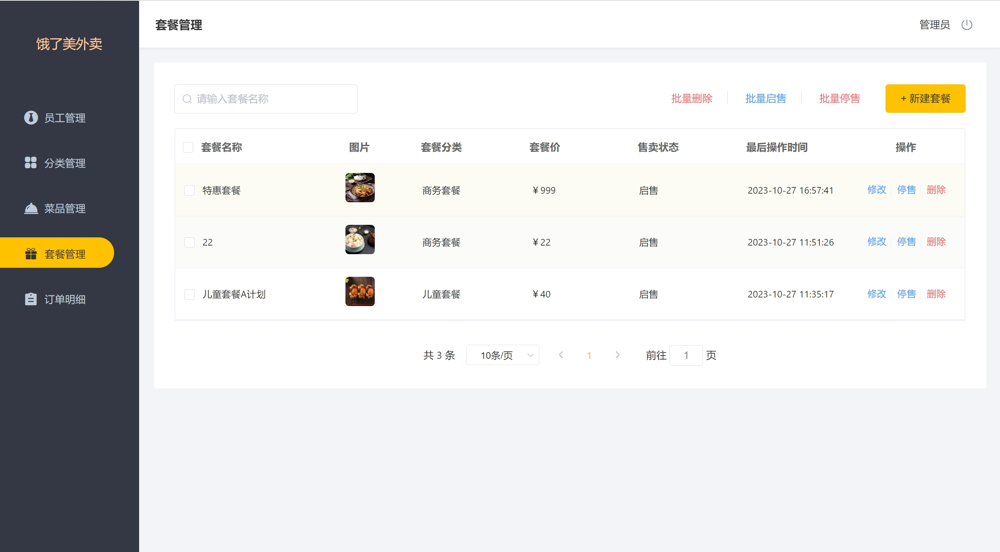
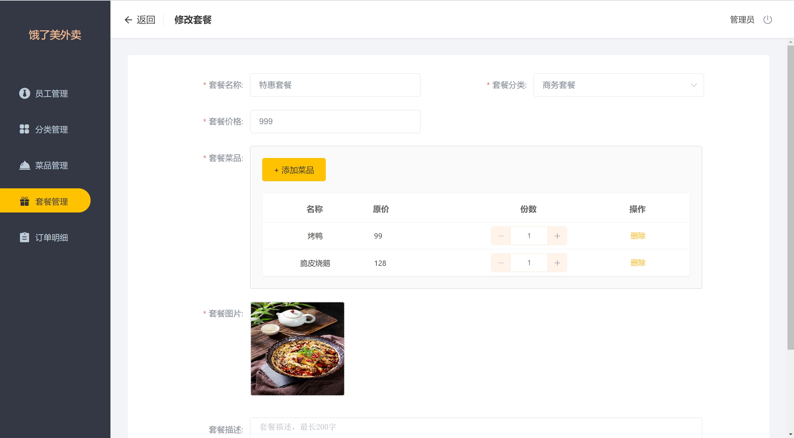

## 基于Java+Springboot的外卖系统(源码+数据库)106

## 一、系统介绍
本系统分为用户端和管理端角色

- 前台用户功能：
登录、菜品浏览，口味选择，加入购物车，地址管理，提交订单。

- 管理后台：
登录，员工管理，分类管理，菜品管理，套餐管理，订单管理。

## 二、所用技术
后端技术栈：
- Springboot
- SpringMvc
- mybatisPlus
- mysql

前端技术栈：
- vue.js
- html
- js
- axios
- css

## 三、环境介绍
基础环境 :IDEA/eclipse, JDK 1.8, Mysql5.7及以上,  Maven3.6,

所有项目以及源代码本人均调试运行无问题 可支持远程调试运行

## 四、页面截图
### 1、小程序app页面

### 2、管理员页面

## 五、浏览地址

- 后台访问路径：http://localhost:8106/front/page/user.html
  账号: 15712341234
- 后台访问路径：http://localhost:8106/backend/index.html
  admin/123456

## 六、安装教程

1. 使用Navicat或者其它工具，在mysql中创建对应名称的数据库，并执行项目的sql

2. 使用IDEA/Eclipse导入reggie-master项目，导入时，若为maven项目请选择maven; 等待依赖下载完成

3. 修改resources目录下面application.yml里面的文件路径配置和数据库配置

4. com/reggie/ReggieApplication.java启动后端项目

